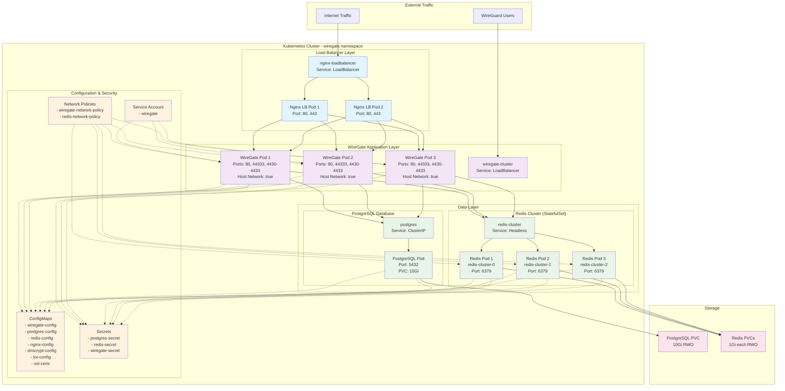

# WireGate Kubernetes Cluster Architecture

## Cluster Overview

The WireGate Kubernetes cluster is designed for high availability and scalability, featuring:

- **3x WireGate Application Pods** (scalable to 5)
- **3x Redis Cluster Pods** (StatefulSet for distributed caching)
- **1x PostgreSQL Database** (shared data store)
- **2x Nginx Load Balancer Pods** (high availability)
- **Network Policies** for security isolation
- **ConfigMaps and Secrets** for configuration management

## Architecture Diagram



## Key Features

### High Availability
- **3x WireGate Pods**: Each with host networking for WireGuard VPN functionality
- **2x Nginx Load Balancers**: Distribute HTTP traffic across WireGate pods
- **3x Redis Cluster**: Distributed caching with StatefulSet for ordered deployment

### Scalability
- WireGate pods can be scaled from 3 to 5 replicas
- Redis cluster automatically scales with WireGate cluster size
- Load balancer can be scaled independently

### Security
- **Network Policies**: Restrict traffic between components
- **Secrets Management**: Encrypted storage for passwords and keys
- **Service Accounts**: Least privilege access for pods
- **Host Networking**: Required for WireGuard VPN functionality

### Data Persistence
- **PostgreSQL**: Shared database with 10Gi persistent volume
- **Redis**: Individual persistent volumes for each Redis pod (1Gi each)

### Port Configuration
- **HTTP**: Port 80 (load balanced)
- **HTTPS**: Port 443 (load balanced)
- **WireGuard Main**: Port 44333 (UDP)
- **WireGuard Zones**: Ports 4430-4433 (UDP)
- **PostgreSQL**: Port 5432 (internal)
- **Redis**: Port 6379 (internal)

### Configuration Management
- **ConfigMaps**: Non-sensitive configuration data
- **Secrets**: Sensitive data like passwords and certificates
- **Environment Variables**: Pod-specific configuration (e.g., Redis host per pod)

## Deployment Commands

```bash
# Deploy the cluster
kubectl apply -k k8s/

# Scale WireGate pods
kubectl scale deployment wiregate-cluster --replicas=5 -n wiregate

# Check pod status
kubectl get pods -n wiregate

# Check services
kubectl get svc -n wiregate

# Check persistent volumes
kubectl get pvc -n wiregate
```

## Monitoring and Logs

```bash
# View logs from all WireGate pods
kubectl logs -l app=wiregate-cluster -n wiregate

# View Redis cluster logs
kubectl logs -l app=redis-cluster -n wiregate

# Check resource usage
kubectl top pods -n wiregate
```
